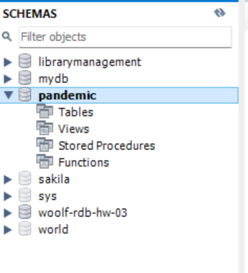
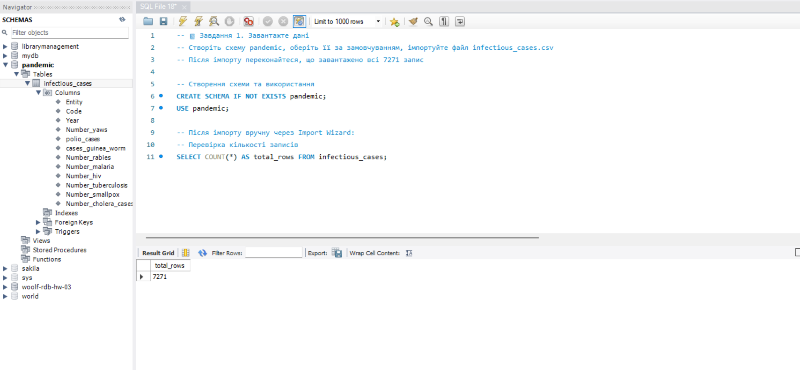
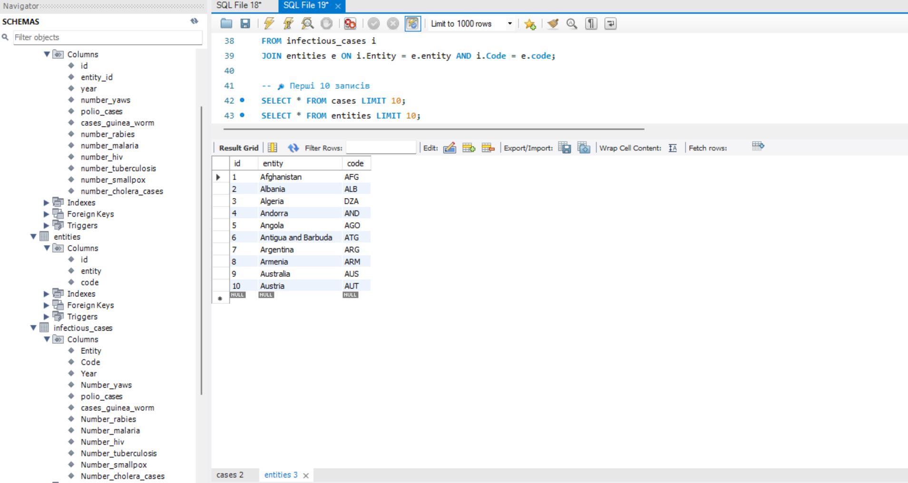
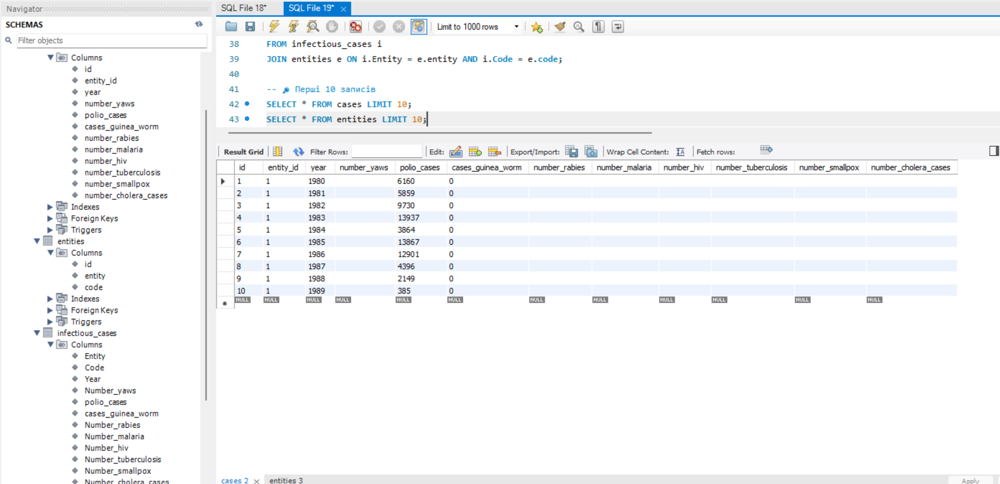
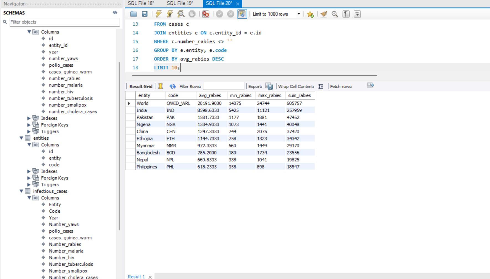
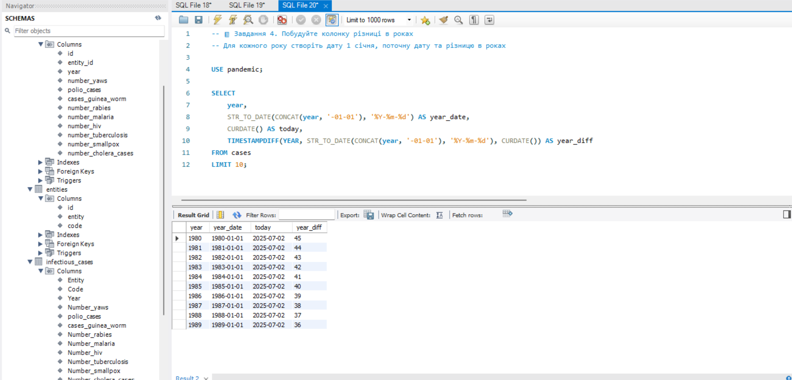
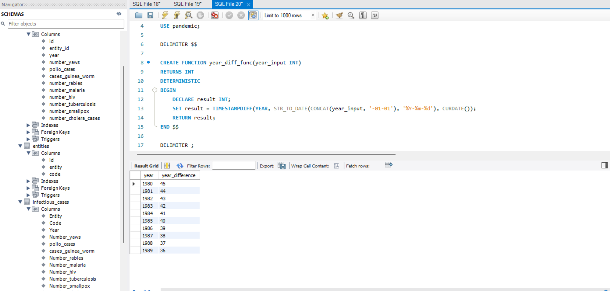

# woolf-rdb-fp

# 🦠 Final Project — WOOLF Relational Databases

Цей репозиторій містить фінальний проєкт курсу з реляційних баз даних. Проєкт включає імпорт, нормалізацію, аналітику та створення SQL-функцій на основі таблиці `infectious_cases`.

---

## ✅ Завдання 1: Імпорт та створення схеми

- Створено схему `pandemic`
- Імпортовано файл `infectious_cases.csv`
- Перевірено кількість рядків: 7271

📸 Скриншоти:
- 
- 

---

## ✅ Завдання 2: Нормалізація таблиці

- Створено таблиці `entities` та `cases` для усунення повторення `Entity` і `Code`
- Перенесено дані відповідно до 3NF

📸 Скриншоти:
- 
- 

---

## ✅ Завдання 3: Аналітичний запит

- Обчислено середнє, мінімальне, максимальне та сумарне значення `Number_rabies`
- Відсортовано за середнім у спадаючому порядку
- Виведено топ-10 результатів

📸 Скриншот:
- 

---

## ✅ Завдання 4: Колонка з різницею в роках

- Створено нову колонку на базі `Year`
- Обчислено дату 1 січня відповідного року
- Знайдено поточну дату та різницю в роках

📸 Скриншот:
- 

---

## ✅ Завдання 5: SQL-функція

- Створено функцію `year_diff_func`, яка приймає рік і повертає різницю в роках
- Запущено приклад використання на таблиці `cases`

📸 Скриншоти:
- 

---

## 📁 Структура репозиторію

- `task_1_import_schema.sql`
- `task_2_normalization.sql`
- `task_3_analysis.sql`
- `task_4_date_diff.sql`
- `task_5_function.sql`
- `README.md`
- `screenshots/` (папка з усіма скриншотами)

---

_Усі SQL-скрипти виконано у MySQL Workbench. Дані зберігаються в схемі `pandemic`._